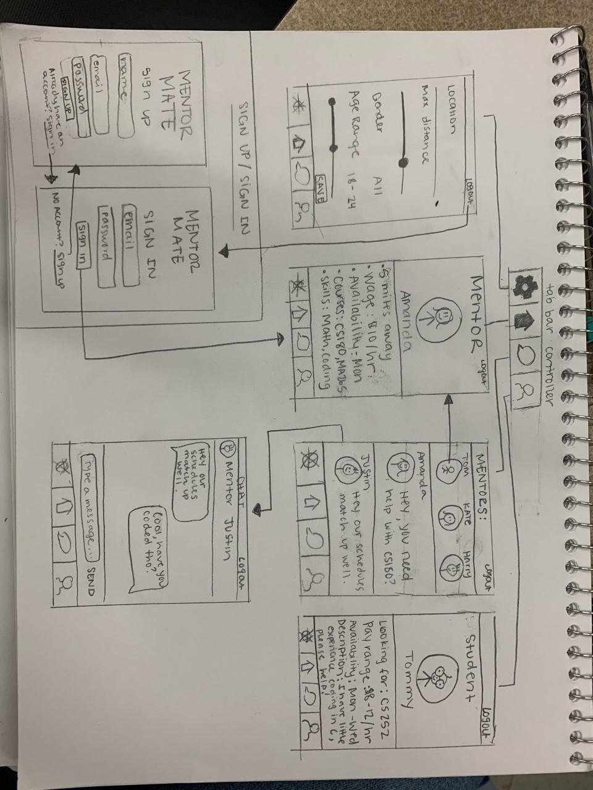

# MentorMate

## Table of Contents
1. [Overview](#Overview)
2. [Product Spec](#Product-Spec)
3. [Wireframe](#Wireframe)
4. [Schema](#Schema)

## Overview

### Description
MentorMate is an iOS app that allows students to find and match with mentors/tutors around their area to help gain the best assistance in classes

### App Evaluation

- **Category:** Educational 

- **Mobile:** This app will be made for a mobile platform particularly for iOS. Extension into a Web App could be a potential future plan. 

- **Story:** Matches students with relevant tutors of the courses they want to be tutored in. The app also provides a chat interface for students to chat with their matched tutors regarding classes.  

- **Market:** Only for tutors and students. 

- **Habit:** This app could be used to find tutors for classes. The chatting interface on the app proves to be a better alternative than sharing personal contact information. This would enable both students and tutors to use the app often for communication purposes.

- **Scope:** Students will be able to view tutor cards on their dashboard. A potential match or a right swipe would mean that the tutor is skilled at a course that the student needs help in. Per say, the app segregates users into two groups namely students and tutors. 

## Product Spec
### 1.User Stories (Required and Optional)

**Required Must-have Stories**

 - [x] User can Sign Up 
 - [x] User can login
 - [ ] User can logout 
 - [ ] User can like (swipe right) or dislike (swipe left) a description of the mentor/student
 - [ ] User can view a feed of different students/mentors
 - [ ] User can chat with the mentor/student if matched
 
 
**Optional Nice-to-have Stories**

 [ ] User can edit, view their profile/description
 [ ] User can view other users' profiles
 [ ] User can Video chat with a matched user

### 2. Screen Archetypes

 * Login Screen
   * User can login
 * Registration Screen
   * User can create a new account
   * Must make an account using a college email
 * Stream Screen
   * User can view a feed of students if a mentor
   * User can view a feed of mentors if a student
   * User can swipe left to "dislike" another user
   * User can swipe right to "like" another user
   * User can chat with another user if matched
 * Creation/Edit Profile
   * User who is a student can add a description of what they would like to learn, what they are willing to pay, and any preferences that they would like of their mentor like availability, gender, etc.
   * User who is a student can add courses they want tutoring in
   * User who is a student can edit their profile
   * User who is a mentor can add a desired wage, availability, a personal description of their skills and knowledgeable subject areas, and any preferences that they would like of their student like availability, gender, etc.
   * User who is a mentor can add courses they are willing to be a tutor for
 * Settings
   * User can edit their profile information.
 * Profile
   * User can view their profile
   * User can view another user's profile if matched

### 3. Navigation

**Tab Navigation** (Tab to Screen)

 * Profile
 * Home Feed
 * Matches
 * Chat Messenger

**Flow Navigation** (Screen to Screen)

 * Login Screen
   * => Stream Screen
   * => Registration
 * Registration Screen
   * => Login Screen
 * Stream Screen
   * => Creation/Edit Profile
   * => Settings
   * => Profile
   * => Login
 * Creation/Edit Profile
   * => Stream Screen
   * => Profile
 * Settings
   * => Stream Screen
   * => Profile
 * Profile
   * => Settings
   * => Stream Screen
   * => Login

## Wireframe


## Schema

### Models

#### User

| Property    | Type                | Description                                         |
| --------    | -----               | -----------                                         |
| objectId    | String              | unique username for the user                        |
| image       |URL                  |image that user posts                                |
| description | String              | information about the user (courses, wage, etc.)    |
| matches     |List <String>        | list of unique users the user matched with          |
| messages    |List <List< Message >> | chat messages user has with others                  | 
| isStudent   | Boolean             | true if user is a student, false if user is a tutor |
| settings    | String              | settings/preferences for each user                  |

#### Message

| Property | Type   | Description         |
| -------- | -------| --------            |
|  text    | String | Text in the message |
|  Sender  | String | userId              |

### Networking

#### List of network requests by screen
* Home Screen (Swiping screen)
    * (Read/GET) Query tutors to swipe left or right on
    ```swift
         let query = PFQuery(className:"Users")
         query.whereKey("isStudent", equalTo: false)
         query.order(byDescending: "createdAt")
         query.findObjectsInBackground { (users: [PFObject]?, error: Error?) in
            if let error = error { 
               print(error.localizedDescription)
            } else if let users = users {
               print("Successfully retrieved \(users.count) users.")
           // TODO: Do something with users...
            }
         }
         ```
* Matches/Chat Screen
    * (Read/GET) Query all users that the current user has matched with (their matches property)
    ```swift
         let query = PFQuery(className:"Users")
         query.whereKey("matches.objectId", equalTo: users.objectId)
         query.order(byDescending: "createdAt")
         query.findObjectsInBackground { (users: [PFObject]?, error: Error?) in
            if let error = error { 
               print(error.localizedDescription)
            } else if let users = users {
               print("Successfully retrieved \(users.count) users.")
           // TODO: Do something with retrieved users (they are users that matched with current user)...
            }
         }
         ```
* Profile Screen
    * (Read/GET) Query logged in user information
    ```swift
         let query = PFQuery(className:"Users")
         query.whereKey("objectId", equalTo: userEnteredName)
         query.findObjectsInBackground { (username: [PFObject]?, error: Error?) in
            if let error = error { 
               print(error.localizedDescription)
            } else if let username = username {
           // TODO: Display all user information on profile screen...
            }
         }
    ```
    * (Update/PUT) Update/change info in Profile
    ```swift
    let query = PFQuery(className:"User")
    query.getObjectInBackground(withId: "user") { (description: PFObject?, error: Error?) in
        if let error = error {
            print(error.localizedDescription)
        } else if let description = description {
            user["description"] = "stuff" //user enters new description
            user.saveInBackground()
        }
    }
    ```
* Settings Screen
    * (Read/GET) View current settings which includes location, distance, age and gender preferences
    ```swift
         let query = PFQuery(className:"Users")
         query.whereKey("objectId", equalTo: userEnteredName)
         query.findObjectsInBackground { (username: [PFObject]?, error: Error?) in
            if let error = error { 
               print(error.localizedDescription)
            } else if let username = username {
           // TODO: Display all user settings on settings screen...
            }
         }
    ```
    * (Update/PUT) Update settings with new preferences
     ```swift
    let query = PFQuery(className:"User")
    query.getObjectInBackground(withId: "user") { (settings: PFObject?, error: Error?) in
        if let error = error {
            print(error.localizedDescription)
        } else if let description = description {
            user["settings"] = "new settings" //new user settings
            user.saveInBackground()
        }
    }
    ```
* Login Screen
    * (Read/GET) Get user's credentials from database and match passwords 
    ```swift
         let query = PFQuery(className:"Users")
         query.whereKey("objectId", equalTo: userEnteredName)
         query.findObjectsInBackground { (password: [PFObject]?, error: Error?) in
            if let error = error { 
               print(error.localizedDescription)
            } else if let userEnteredPassword = password {
               print("Successful login")
           // TODO: Redirect user home screen for succcessful login
            }
         }
         ```
* Registration Screen
    * (Create/POST) Create a new user
         ```swift
         let newUser = PFObject(className:"User")
         newUser["objectId"] = "username" //valid username that user chooses
         newUser["image"] = "url" //some image url user chooses
         newUser["description"] = "bio"
         newUser["matches"] = null
         newUser["messages"] = null
         newUser["isStudent"] = true //if user is a student, false otherwise
         newUser.saveInBackground { (succeeded, error)  in
            if (succeeded) {
                // The object has been saved.
            } else {
                // There was a problem, check error.description
            }
        }
         ```
    * (Read/GET) Get data of other users to check if the username already exists
     ```swift
         let query = PFQuery(className:"Users")
         query.whereKey("objectId", equalTo: userEnteredName)
         query.findObjectsInBackground { (username: [PFObject]?, error: Error?) in
            if let error = error { 
               print(error.localizedDescription)
            } else if let username = username {
               print("Username already exists! Please choose another name.")
           // TODO: Redirect user to type in a valid username...
            }
         }
    ```
## Video Walkthroughs

Login


 
Signup


